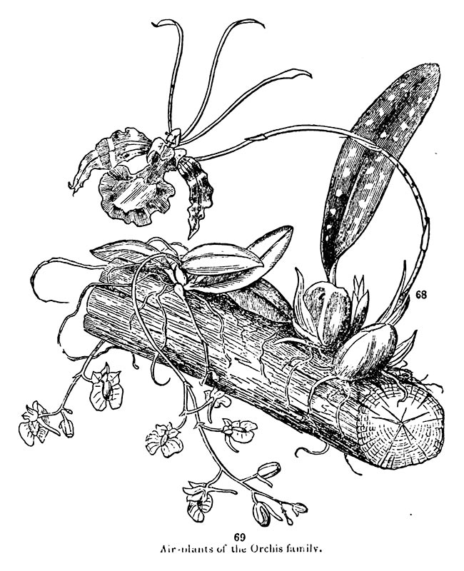

## This software is experimental. Contributions are welcome, but production use is discouraged

# Epiphyte

With Epiphyte you can quickly and reliably create tiny (<10MB). delightful applications that can thrive on a multitude of surfaces (Windows, OS X, Linux, Android, iOS, Raspberry Pi, Beaglebone, etc.).



*Image From, "Botany for young people and common schools" 1868 by Asa Gray [Source](https://commons.wikimedia.org/wiki/File:Botany_for_young_people_and_common_schools_(1868)_(20219036949).jpg)*

Epiphyte is built using the [Go language](https://golang.org/) and [Cairo graphics engine](https://cairographics.org/).

Epiphyte provides:
* Cross-platform, GPU accelerated drawing surface (via [Cairo](https://cairographics.org))
* Simple, reactive and extensible UI components
* Pure Go component declaration and configuration
* Tiny, blazing fast, constraints-based flexible box layout engine
* Custom styling support for provided (and user-created) components

# Getting Started

Step one: Install some version of Go to the system > 1.4. This version will be used purely to build our local version.

Once this is done, change to this directory and run the following (on Darwin/OS X or Linux):

```bash
source setup-env.sh
make dev-install
```

# What is, "pure Go component declaration"?
```go
package main

import . "github.com/lukebayes/epiphyte/display"

func Render(s Surface) {
  Window(s, func() {
    Styles(s, func() {
      Style("Window", BgColor(0xfc0), FontFace("sans"), FontSize(12), Padding(20))
      Style("Header", FontSize(18))
    })
    VBox(s, func() {
      Header(s, &Opts{Height: 80, FlexWidth: 1})
      Body(s, &Opts{FlexHeight: 1, FlexWidth: 1})
      Footer(s, &Opts{Height: 60, FlexWidth: 1})
    })
  })
}
```


# Development environment

### Manual Prerequisites
You'll need to get the following installed on your computer in order to proceed:
* Git
* Make
* Some version of Go (since it's now bootstrapped)
* Possibly some dev headers for Cairo

*Notes:*
We will download, build and install a specific version of Go and any other tools into the `${PROJECT_PATH}/lib` folder to ensure that all development happens against the same source tree.

We are currently integrated with the Cairo 2d drawing library. This library was selected over Skia simply because Skia's C interface is still experimental and does not support most of the features we need. Cairo also seems to build more easily.

## Download and install
```
git clone https://github.com/lukebayes/findingyou.git .
cd golang
make dev-install
# Wait and wait for Cairo to be built
```

## On Linux

I'm still having trouble getting this to work on Ubuntu...

## Run tests
```
make test
```
Or to get verbose test output:
```
make test-v
```

I use a Python script called, "when-changed.py" (search Google) to watch source files and re-run `make test` whenever a file changes. This seems to work just fine for me.

## Build & run binary for development
This should build the binaries from the latest sources on your computer
```
make build
```
Or to build & run in one step
```
make run
```
Build artifacts can be found in `./out`
